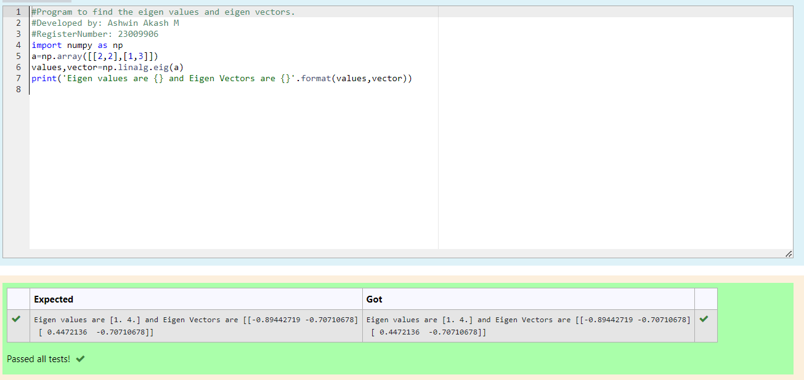

# EIGENVALUES-AND-EIGENVECTORS
## Aim:
To write a python program to find the Eigenvalues and Eigen Vectors
## Equipment’s required:
1. 	Hardware – PCs
2. 	Anaconda – Python 3.7 Installation / Moodle-Code Runner
## Algorithm:
### Step1 : 
Start the program.
### Step 2: 
import numpy which is an built-in function and get the list values. 
### Step 3:
 Using the np.linalg.eig(),  we get two results (first is eigenvalue and second is eigenvector) of the given matrix.
### Step 4: 
End the program
## Program:
```
#Program to find the eigen values and eigen vectors.
#Developed by: Ashwin Akash M
#RegisterNumber: 23009906
import numpy as np
a=np.array([[2,2],[1,3]])
values,vector=np.linalg.eig(a)
print('Eigen values are {} and Eigen Vectors are {}'.format(values,vector))

```
## Output:


## Result:
Thus the Eigenvalue and Eigenvector is successfully solved using python program
